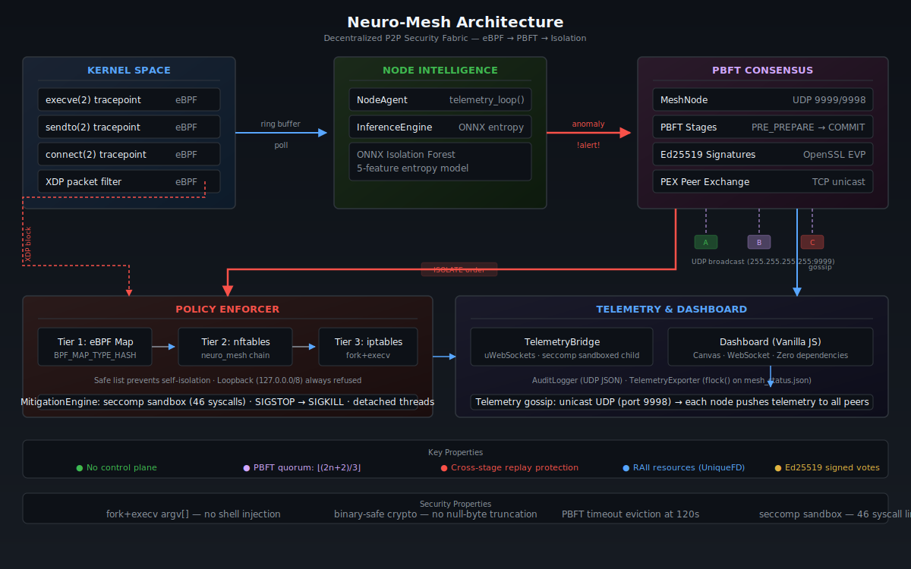

# Neuro-Mesh

<p align="center">
  
  
  
  
  
  
  
</p>

<p align="center"><b>No master. No control plane. No single point of failure.</b></p>

<p align="center">
  
</p>

**Neuro-Mesh** is a decentralized P2P security fabric. Every node runs eBPF kernel probes, detects anomalies with entropy-based inference, votes on threats via Ed25519-signed PBFT consensus over UDP, and enforces network isolation — all without a central coordinator. If one node falls, the mesh votes and moves on.

---

## How It Works

```
   KERNEL                    USERSPACE                         NETWORK

  eBPF probes         InferenceEngine                   ┌──────────────────┐
  ┌──────────┐        ┌──────────────┐                  │   P2P MESH       │
  │ execve   │──┐     │              │     PBFT vote    │                  │
  │ sendto   │  │     │  Entropy     │──────────────────▶│  PRE_PREPARE     │
  │ connect  │  │────▶│  Scoring     │                   │  PREPARE         │
  │ XDP      │  │     │              │◀──────────────────│  COMMIT          │
  └──────────┘  │     └──────────────┘   votes from      │  EXECUTED        │
                │                        peers           └────────┬─────────┘
                │     ┌──────────────┐                           │
                │     │              │     isolation order       │
                └────▶│  NodeAgent   │◀──────────────────────────┘
                      │              │
                      └──────┬───────┘
                             │
                      ┌──────▼───────┐
                      │ Policy       │
                      │ Enforcer     │
                      │              │
                      │ eBPF map     │
                      │ nftables     │
                      │ iptables     │
                      └──────────────┘
```

1. **eBPF probes** hook `execve`, `sendto`, `connect`, and XDP — capturing kernel-level events in real time
2. **InferenceEngine** scores event entropy; anomalies trigger a consensus round
3. **PBFT consensus** runs over UDP broadcast — every node votes, every vote is Ed25519-signed
4. **PolicyEnforcer** isolates guilty peers via a 3-tier cascade: eBPF map → nftables → iptables
5. **Telemetry gossip** — each node unicasts its state to all peers; any node can serve the full mesh dashboard

No leader election. No raft. The mesh *is* the authority.

---

## Quick Start

### Prerequisites

| Dependency | Why |
|------------|-----|
| clang/LLVM 18+ | C++20 + eBPF backend |
| libbpf, libelf, zlib | eBPF loader |
| OpenSSL 3.x | Ed25519 signatures |
| bpftool | eBPF skeleton generation |
| nftables / iptables | Network isolation |
| Docker (optional) | Containerized mesh |

### Build

```bash
make clean && make       # build neuro_agent
make test                # build & run all tests
make tools               # inject_event + test_crypto
```

Four binaries land in `bin/`: `neuro_agent` (the node), `inject_event` (threat injector), plus 8 test binaries under `bin/test_*`.

### Run

```bash
# Single node
./bin/neuro_agent ALPHA

# 5-node mesh (background processes)
for node in ALPHA BRAVO CHARLIE DELTA ECHO; do
    ./bin/neuro_agent $node &>/tmp/neuro_$node.log &
done

# Or via tmux grid
./mesh_dashboard.sh

# Serve the dashboard (static HTML + WebSocket)
python3 -m http.server 8888 -d dashboard/ &
# Dashboard: http://localhost:8888
# Connects to ws://localhost:9000–9040 for live telemetry
```

Each node binds a unique WebSocket port for its TelemetryBridge:

| Node | WebSocket | IPC Socket |
|------|-----------|------------|
| ALPHA | 9000 | `/tmp/neuro_mesh_ALPHA.sock` |
| BRAVO | 9010 | `/tmp/neuro_mesh_BRAVO.sock` |
| CHARLIE | 9020 | `/tmp/neuro_mesh_CHARLIE.sock` |
| DELTA | 9030 | `/tmp/neuro_mesh_DELTA.sock` |
| ECHO | 9040 | `/tmp/neuro_mesh_ECHO.sock` |

A stateless WS proxy (`orchestration/ws_proxy.py`) on port 9001 tries all 5 backends with failover — useful when the browser can't reach host-network ports directly (Docker/WSL2). On native Linux the dashboard connects straight to node IPs.

### Docker

```bash
docker compose up -d                         # 5 nodes + dashboard
docker compose ps                            # verify all 5 running
open http://localhost:8080                   # dashboard
docker compose down                          # tear down

---

## Testing

### Unit Tests

```bash
make test   # Build & run all test binaries (gtest + standalone)
```

Eight test binaries cover every subsystem (70+ tests):

| Binary | What it tests |
|--------|---------------|
| `test_common` (gtest) | `UniqueFD`, `Result`, `Base64`, `StateJournal` — 21 tests |
| `test_mitigation` (gtest) | `MitigationEngine` response orchestration — 9 tests |
| `test_auditlogger` (gtest) | `AuditLogger` JSON emit, sanitization — 7 tests |
| `test_pbft` | PBFT state machine — quorum, signature binding, dedup — 10 tests |
| `test_enforcer` | PolicyEnforcer safe-list, IP validation, cascade — 9 tests |
| `test_meshnode` | Discovery, PEX handshake, peer management — 9 tests |
| `test_inference` | ONNX entropy scoring, decay — 5 tests |
| `test_crypto` | Ed25519 sign/verify — 3 tests |

All tests must pass before any merge.

### Integration Test

Full end-to-end pipeline: Docker Compose boot → event injection → PBFT consensus → network isolation verification:

```bash
sudo ./tests/integration_test.sh
```

What it asserts:
1. All 5 nodes + dashboard container start successfully
2. Cross-node network reachability
3. `inject_event` delivers a CRITICAL threat into the mesh
4. PBFT consensus reaches COMMIT and triggers PolicyEnforcer
5. `iptables -S` shows the target peer isolated
6. Safe list prevents self-isolation (loopback still works)

### CI Pipeline

Every push to `main` triggers [GitHub Actions](.github/workflows/build.yml):
- **Build**: Full `make clean && make` compilation
- **Unit tests**: All 5 test binaries executed
- **Lint**: `clang-tidy` on key source files
- **Security audit**: grep for banned functions (`system()`, `gets()`, `strcpy`)
- **Docker integration**: `docker compose up` → inject → verify isolation

---

## Attack Simulation

### Targeted injection — make one node accuse another

```bash
# Native (IPC socket)
./bin/inject_event --node CHARLIE --target DELTA \
  --event entropy_spike --verdict CRITICAL --tag mytest

# Docker
docker exec neuro_charlie /app/inject_event \
  --node CHARLIE --target ALPHA \
  --event entropy_spike --verdict CRITICAL
```

The injector sends `CMD:INJECT` over the node's Unix socket. The node kicks off a PBFT round against the target. Watch the dashboard — consensus stages fire, votes flood the mesh, and the target gets isolated (on a real Linux host with CAP_NET_ADMIN).

### Full-mesh chaos — trigger eBPF entropy on every node

```bash
docker exec neuro_charlie python3 /app/traffic_generator.py \
  --target 127.0.0.1 --duration 15 --threads 8
```

Multi-threaded UDP flood + TCP port scan. Since all containers share `network_mode: host`, a flood to `127.0.0.1` lights up every node's eBPF sensors simultaneously.

---

## PBFT Consensus

Four stages, no leader:

| Stage | What Happens |
|-------|--------------|
| `PRE_PREPARE` | Detector broadcasts target + evidence |
| `PREPARE` | Peers verify & broadcast their vote |
| `COMMIT` | Quorum reached — prepare to execute |
| `EXECUTED` | MitigationEngine enforces isolation |

Quorum = `(2n + 2) / 3` ≥ `2f + 1` Byzantine fault tolerance. Every message binds `(stage | target | evidence)` under Ed25519 — no cross-stage replay, no spoofed votes. Self-votes go through the same verification path as external votes. Zero trust.

Rounds expire after 120s of inactivity to bound memory.

---

## Enforcement

PolicyEnforcer probes available backends at startup and picks the best:

| Priority | Backend | Mechanism |
|----------|---------|-----------|
| 1 | eBPF map | `BPF_MAP_TYPE_HASH` blocklist in `/sys/fs/bpf/neuro_mesh/` |
| 2 | nftables | Dedicated `neuro_mesh` chain |
| 3 | iptables | `fork()` + `execv()` — no shell, no injection |

MitigationEngine extends this with process termination (SIGSTOP → SIGKILL) and network isolation in detached threads.

The TelemetryBridge runs as a sandboxed child process: `fork()` → `prctl(PR_SET_NO_NEW_PRIVS)` → `chroot("/var/empty")` → uid/gid drop to `nobody` → 47-syscall seccomp-BPF default-kill filter. On WSL2 or unprivileged containers, sandbox stages degrade gracefully (warn-and-continue) so the WebSocket bridge stays operational.

**Safe list** — `add_safe_node()` prevents self-isolation. Loopback (`127.0.0.0/8`) is always refused.

---

## Security

| Property | How |
|----------|-----|
| Shell injection impossible | `fork()` + `execv()` with `argv[]`, never `system()` |
| Binary-safe crypto | `std::string::data()` / `size()` — no null-byte truncation |
| Cross-stage replay protection | Signatures bind `(stage + target + evidence)` |
| Self-isolation prevention | Safe list + loopback guard |
| Bounded memory | PBFT rounds evicted at 120s; eBPF ring buffer drained in tight loop |
| Atomic telemetry | `flock()` on shared JSON sink |
| RAII resources | `UniqueFD` wraps all socket FDs |
| Crash recovery | `StateJournal` replays journal on boot |

---

## Project Map

```
neuro_mesh/
├── kernel/            eBPF probes (sensor.bpf.c, neuro_bpf.c XDP filter)
├── cell/              NodeAgent + InferenceEngine (entropy scoring)
├── consensus/         MeshNode (UDP P2P gossip) + PeerManager + PBFT state machine
├── crypto/            Ed25519 keygen, sign, verify (OpenSSL EVP) + KeyManager (PKCS#11)
├── enforcer/          PolicyEnforcer (3-tier block) + MitigationEngine (process kill)
├── telemetry/         AuditLogger (UDP JSON) + TelemetryBridge (sandboxed WS child, seccomp)
├── net/               TLS transport layer (tofu certificate pinning)
├── common/            StateJournal, UniqueFD, Result<T,E>, Base64
├── attacks/           AttackSimulator (synthetic threat patterns)
├── orchestration/     Python tools — ws_proxy, mesh_manager, anomaly_classifier
├── tools/             inject_event, test_crypto, traffic_generator, benchmark_mesh
├── dashboard/         Vanilla JS dashboard (Canvas + WebSocket, zero dependencies)
├── main.cpp           Entry point — wires all subsystems
└── docker-compose.yml 5-node decentralized mesh
```

---

## MITRE D3FEND & NIST CSF

Neuro-Mesh maps to the **D3FEND** countermeasure framework and the **NIST Cybersecurity Framework** across all five functions:

| CSF Function | Neuro-Mesh Capability |
|--------------|----------------------|
| **IDENTIFY** | UDP peer discovery, StateJournal crash replay, `/proc/net/dev` baselining |
| **PROTECT** | Ed25519 PBFT signing, safe-list, seccomp sandbox, fork+execv hardening |
| **DETECT** | eBPF tracepoints (execve/sendto/connect), entropy scoring, traffic anomaly classifier |
| **RESPOND** | PBFT BFT consensus → MitigationEngine isolation → 3-backend network block |
| **RECOVER** | `CMD:RESET` releases all blocks, StateJournal provides full forensic audit trail |

Full D3FEND technique mapping (D3-PT, D3-NTF, D3-IPI, D3-SEA, D3-PM, D3-IRA) with file:line references is in [CLAUDE.md](CLAUDE.md).

---

## Platform Notes

### WSL2 / Unprivileged Containers

Running without full root capabilities (WSL2, restricted Docker containers) has known limitations:

| Feature | Native Linux | WSL2 |
|---------|-------------|------|
| eBPF sensors | Full kernel probes | Falls back to `/proc/net/dev` entropy |
| iptables enforcement | Works | Requires `sudo` / `CAP_NET_ADMIN` |
| TelemetryBridge sandbox | Full chroot + seccomp + uid drop | Sandbox degrades gracefully (warn-and-continue) |
| PBFT consensus | Full | Full — no root needed for voting |
| Dashboard + telemetry | Full | Full |

PBFT consensus, telemetry gossip, and the dashboard work identically on WSL2. Only kernel-level enforcement and eBPF probing are degraded.

---

## License

MIT — see [LICENSE](LICENSE).
